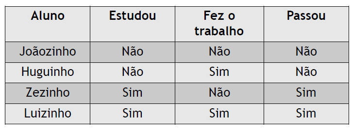

# Perceptron 

Esse repositório aplica  um algoritmo que realiza a implementação de um perceptron em python, onde utiliza os dados da tabela abaixo:



> Onde **não** = 0 e **sim** = 1 !!

Esse algoritmo foi uma atividade da disciplina de IA no conteúdo de redes neurais da UFRPE-UABJ.


> [!NOTE]
> O perceptron convergiu com 6 ciclos. A execução é mostrada a seguir:

````txt
INICIANDO TREINAMENTO DO PERCEPTRON 
Pesos iniciais: [Bias (w0): 0.0, w1: 0.0, w2: 0.0]

Ciclo 1 - Processando os exemplos de treinamento...
Exemplo 1 -> Entradas: (0, 0) | Saída Real (y): 0
  Soma Ponderada: 0.00 -> Saída Prevista: 0
 ACERTO! Pesos mantidos.
----------------------------------------
Exemplo 2 -> Entradas: (0, 1) | Saída Real (y): 0
  Soma Ponderada: 0.00 -> Saída Prevista: 0
 ACERTO! Pesos mantidos.
----------------------------------------
Exemplo 3 -> Entradas: (1, 0) | Saída Real (y): 0
  Soma Ponderada: 0.00 -> Saída Prevista: 0
 ACERTO! Pesos mantidos.
----------------------------------------
Exemplo 4 -> Entradas: (1, 1) | Saída Real (y): 1
  Soma Ponderada: 0.00 -> Saída Prevista: 0
    ERRO DETECTADO (Erro = 1)! Atualizando pesos:
    Bias (w0): 0.0 + (0.5 * 1 * 1) = 0.5
    Peso 1 (w1): 0.0 + (0.5 * 1 * 1) = 0.5
    Peso 2 (w2): 0.0 + (0.5 * 1 * 1) = 0.5
----------------------------------------
Ciclo 2 - Processando os exemplos de treinamento...
Exemplo 1 -> Entradas: (0, 0) | Saída Real (y): 0
  Soma Ponderada: 0.50 -> Saída Prevista: 1
    ERRO DETECTADO (Erro = -1)! Atualizando pesos:
    Bias (w0): 0.5 + (0.5 * -1 * 1) = 0.0
    Peso 1 (w1): 0.5 + (0.5 * -1 * 0) = 0.5
    Peso 2 (w2): 0.5 + (0.5 * -1 * 0) = 0.5
----------------------------------------
Exemplo 2 -> Entradas: (0, 1) | Saída Real (y): 0
  Soma Ponderada: 0.50 -> Saída Prevista: 1
    ERRO DETECTADO (Erro = -1)! Atualizando pesos:
    Bias (w0): 0.0 + (0.5 * -1 * 1) = -0.5
    Peso 1 (w1): 0.5 + (0.5 * -1 * 0) = 0.5
    Peso 2 (w2): 0.5 + (0.5 * -1 * 1) = 0.0
----------------------------------------
Exemplo 3 -> Entradas: (1, 0) | Saída Real (y): 0
  Soma Ponderada: 0.00 -> Saída Prevista: 0
 ACERTO! Pesos mantidos.
----------------------------------------
Exemplo 4 -> Entradas: (1, 1) | Saída Real (y): 1
  Soma Ponderada: 0.00 -> Saída Prevista: 0
    ERRO DETECTADO (Erro = 1)! Atualizando pesos:
    Bias (w0): -0.5 + (0.5 * 1 * 1) = 0.0
    Peso 1 (w1): 0.5 + (0.5 * 1 * 1) = 1.0
    Peso 2 (w2): 0.0 + (0.5 * 1 * 1) = 0.5
----------------------------------------
Ciclo 3 - Processando os exemplos de treinamento...
Exemplo 1 -> Entradas: (0, 0) | Saída Real (y): 0
  Soma Ponderada: 0.00 -> Saída Prevista: 0
 ACERTO! Pesos mantidos.
----------------------------------------
Exemplo 2 -> Entradas: (0, 1) | Saída Real (y): 0
  Soma Ponderada: 0.50 -> Saída Prevista: 1
    ERRO DETECTADO (Erro = -1)! Atualizando pesos:
    Bias (w0): 0.0 + (0.5 * -1 * 1) = -0.5
    Peso 1 (w1): 1.0 + (0.5 * -1 * 0) = 1.0
    Peso 2 (w2): 0.5 + (0.5 * -1 * 1) = 0.0
----------------------------------------
Exemplo 3 -> Entradas: (1, 0) | Saída Real (y): 0
  Soma Ponderada: 0.50 -> Saída Prevista: 1
    ERRO DETECTADO (Erro = -1)! Atualizando pesos:
    Bias (w0): -0.5 + (0.5 * -1 * 1) = -1.0
    Peso 1 (w1): 1.0 + (0.5 * -1 * 1) = 0.5
    Peso 2 (w2): 0.0 + (0.5 * -1 * 0) = 0.0
----------------------------------------
Exemplo 4 -> Entradas: (1, 1) | Saída Real (y): 1
  Soma Ponderada: -0.50 -> Saída Prevista: 0
    ERRO DETECTADO (Erro = 1)! Atualizando pesos:
    Bias (w0): -1.0 + (0.5 * 1 * 1) = -0.5
    Peso 1 (w1): 0.5 + (0.5 * 1 * 1) = 1.0
    Peso 2 (w2): 0.0 + (0.5 * 1 * 1) = 0.5
----------------------------------------
Ciclo 4 - Processando os exemplos de treinamento...
Exemplo 1 -> Entradas: (0, 0) | Saída Real (y): 0
  Soma Ponderada: -0.50 -> Saída Prevista: 0
 ACERTO! Pesos mantidos.
----------------------------------------
Exemplo 2 -> Entradas: (0, 1) | Saída Real (y): 0
  Soma Ponderada: 0.00 -> Saída Prevista: 0
 ACERTO! Pesos mantidos.
----------------------------------------
Exemplo 3 -> Entradas: (1, 0) | Saída Real (y): 0
  Soma Ponderada: 0.50 -> Saída Prevista: 1
    ERRO DETECTADO (Erro = -1)! Atualizando pesos:
    Bias (w0): -0.5 + (0.5 * -1 * 1) = -1.0
    Peso 1 (w1): 1.0 + (0.5 * -1 * 1) = 0.5
    Peso 2 (w2): 0.5 + (0.5 * -1 * 0) = 0.5
----------------------------------------
Exemplo 4 -> Entradas: (1, 1) | Saída Real (y): 1
  Soma Ponderada: 0.00 -> Saída Prevista: 0
    ERRO DETECTADO (Erro = 1)! Atualizando pesos:
    Bias (w0): -1.0 + (0.5 * 1 * 1) = -0.5
    Peso 1 (w1): 0.5 + (0.5 * 1 * 1) = 1.0
    Peso 2 (w2): 0.5 + (0.5 * 1 * 1) = 1.0
----------------------------------------
Ciclo 5 - Processando os exemplos de treinamento...
Exemplo 1 -> Entradas: (0, 0) | Saída Real (y): 0
  Soma Ponderada: -0.50 -> Saída Prevista: 0
 ACERTO! Pesos mantidos.
----------------------------------------
Exemplo 2 -> Entradas: (0, 1) | Saída Real (y): 0
  Soma Ponderada: 0.50 -> Saída Prevista: 1
    ERRO DETECTADO (Erro = -1)! Atualizando pesos:
    Bias (w0): -0.5 + (0.5 * -1 * 1) = -1.0
    Peso 1 (w1): 1.0 + (0.5 * -1 * 0) = 1.0
    Peso 2 (w2): 1.0 + (0.5 * -1 * 1) = 0.5
----------------------------------------
Exemplo 3 -> Entradas: (1, 0) | Saída Real (y): 0
  Soma Ponderada: 0.00 -> Saída Prevista: 0
 ACERTO! Pesos mantidos.
----------------------------------------
Exemplo 4 -> Entradas: (1, 1) | Saída Real (y): 1
  Soma Ponderada: 0.50 -> Saída Prevista: 1
 ACERTO! Pesos mantidos.
----------------------------------------
Ciclo 6 - Processando os exemplos de treinamento...
Exemplo 1 -> Entradas: (0, 0) | Saída Real (y): 0
  Soma Ponderada: -1.00 -> Saída Prevista: 0
 ACERTO! Pesos mantidos.
----------------------------------------
Exemplo 2 -> Entradas: (0, 1) | Saída Real (y): 0
  Soma Ponderada: -0.50 -> Saída Prevista: 0
 ACERTO! Pesos mantidos.
----------------------------------------
Exemplo 3 -> Entradas: (1, 0) | Saída Real (y): 0
  Soma Ponderada: 0.00 -> Saída Prevista: 0
 ACERTO! Pesos mantidos.
----------------------------------------
Exemplo 4 -> Entradas: (1, 1) | Saída Real (y): 1
  Soma Ponderada: 0.50 -> Saída Prevista: 1
 ACERTO! Pesos mantidos.
----------------------------------------

 ATENÇÃO : CONVERGÊNCIA ATINGIDA NO CICLO !!6!
Pesos Finais Ajustados: [Bias (w0): -1.0, w1: 1.0, w2: 0.5]
````